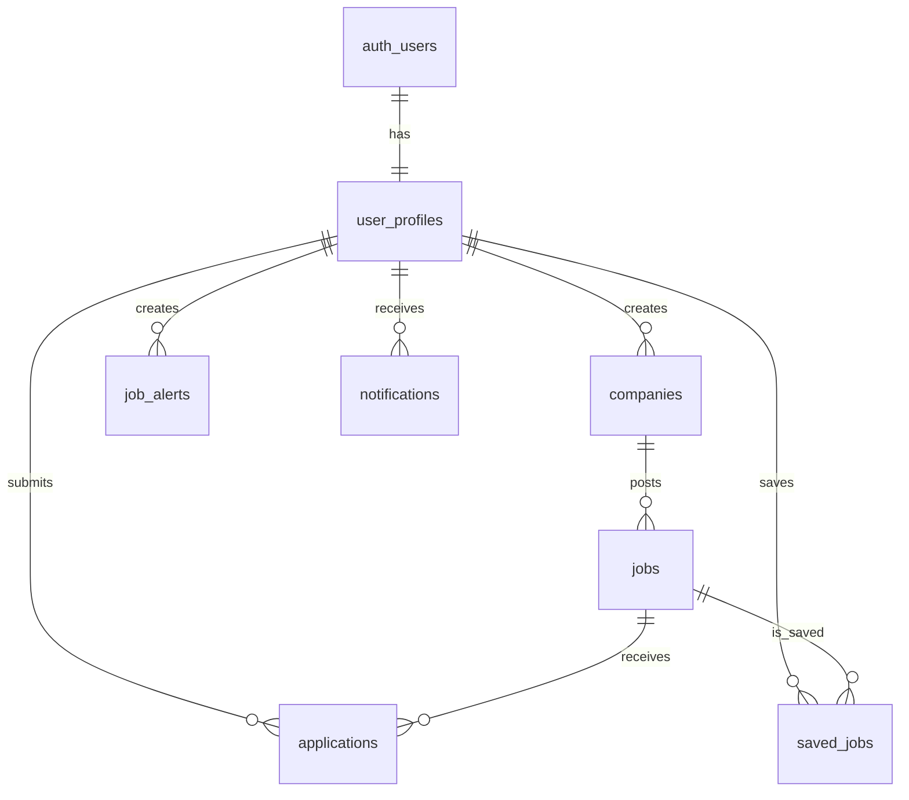

# Architecture Overview
*Technical architecture for the enhanced job portal*

## System Architecture

### Frontend Architecture
```
┌─────────────────────────────────────────┐
│                Frontend                 │
│              (Next.js 14)               │
├─────────────────────────────────────────┤
│  App Router Structure:                  │
│  ├── (auth)/                           │
│  │   ├── login/                        │
│  │   └── signup/                       │
│  ├── (dashboard)/                      │
│  │   ├── job-seeker/                   │
│  │   └── employer/                     │
│  ├── jobs/                             │
│  │   ├── [id]/                         │
│  │   └── search/                       │
│  ├── companies/                        │
│  └── admin/                            │
├─────────────────────────────────────────┤
│  Components Layer:                      │
│  ├── UI Components (Tailwind + Headless)│
│  ├── Feature Components                │
│  ├── Layout Components                 │
│  └── Form Components                   │
├─────────────────────────────────────────┤
│  State Management:                      │
│  ├── React Context (Auth, User)        │
│  ├── SWR/React Query (Server State)    │
│  └── Local State (useState, useReducer)│
└─────────────────────────────────────────┘
```

### Backend Architecture
```
┌─────────────────────────────────────────┐
│              Backend                    │
│             (Supabase)                  │
├─────────────────────────────────────────┤
│  Database (PostgreSQL):                 │
│  ├── User Management                    │
│  ├── Job Listings                       │
│  ├── Applications                       │
│  ├── Companies                          │
│  └── Notifications                      │
├─────────────────────────────────────────┤
│  Authentication:                        │
│  ├── Email/Password                     │
│  ├── Social Logins (Google, GitHub)     │
│  ├── Magic Links                        │
│  └── Role-based Access Control          │
├─────────────────────────────────────────┤
│  Storage:                               │
│  ├── Resume Files                       │
│  ├── Company Logos                      │
│  ├── Profile Images                     │
│  └── Culture Images                     │
├─────────────────────────────────────────┤
│  Edge Functions:                        │
│  ├── Email Notifications                │
│  ├── Job Matching Algorithm             │
│  ├── Application Processing             │
│  └── Analytics Processing               │
└─────────────────────────────────────────┘
```

## Database Schema Design

### Core Tables Relationships


### Key Tables Structure

#### user_profiles
- **Purpose**: Extended user information beyond auth
- **Key Fields**: user_type, first_name, last_name, skills, experience_level
- **Indexes**: user_id, user_type, location, skills

#### companies
- **Purpose**: Company information and branding
- **Key Fields**: name, description, industry, size, benefits
- **Indexes**: name, industry, size, location

#### jobs
- **Purpose**: Job listings with comprehensive details
- **Key Fields**: title, description, location, salary_range, job_type
- **Indexes**: title, location, company_id, job_type, created_at
- **Full-text Search**: title, description, requirements

#### applications
- **Purpose**: Job application tracking
- **Key Fields**: job_id, applicant_id, status, applied_at
- **Indexes**: job_id, applicant_id, status, applied_at

## Component Architecture

### Component Hierarchy
```
App
├── Layout
│   ├── Header
│   │   ├── Navigation
│   │   ├── UserMenu
│   │   └── SearchBar
│   ├── Sidebar (Dashboard)
│   └── Footer
├── Pages
│   ├── JobSearch
│   │   ├── SearchFilters
│   │   ├── JobList
│   │   │   └── JobCard
│   │   └── MapView
│   ├── JobDetail
│   │   ├── JobInfo
│   │   ├── CompanyInfo
│   │   └── ApplicationForm
│   └── Dashboard
│       ├── JobSeekerDashboard
│       │   ├── ApplicationsTable
│       │   ├── SavedJobs
│       │   └── ProfileCompletion
│       └── EmployerDashboard
│           ├── JobManagement
│           ├── ApplicationsReview
│           └── Analytics
└── Shared Components
    ├── Forms
    ├── Modals
    ├── Loading States
    └── Error Boundaries
```

### State Management Strategy

#### Authentication State
```typescript
interface AuthState {
  user: User | null;
  profile: UserProfile | null;
  loading: boolean;
  error: string | null;
}
```

#### Job Search State
```typescript
interface SearchState {
  query: string;
  filters: SearchFilters;
  results: Job[];
  loading: boolean;
  pagination: PaginationState;
}
```

#### Application State
```typescript
interface ApplicationState {
  applications: Application[];
  savedJobs: SavedJob[];
  notifications: Notification[];
  loading: boolean;
}
```

## API Design

### REST Endpoints
```
Jobs:
  GET    /api/jobs              - List jobs with filters
  GET    /api/jobs/:id          - Get job details
  POST   /api/jobs              - Create job (employer)
  PUT    /api/jobs/:id          - Update job (employer)
  DELETE /api/jobs/:id          - Delete job (employer)

Applications:
  GET    /api/applications      - List user's applications
  POST   /api/applications      - Submit application
  PUT    /api/applications/:id  - Update application status
  DELETE /api/applications/:id  - Withdraw application

Companies:
  GET    /api/companies         - List companies
  GET    /api/companies/:id     - Get company details
  POST   /api/companies         - Create company profile
  PUT    /api/companies/:id     - Update company profile

Search:
  GET    /api/search/jobs       - Search jobs with filters
  GET    /api/search/companies  - Search companies
  POST   /api/search/save       - Save search query
```

### Real-time Features
```
Supabase Realtime Subscriptions:
- New job postings
- Application status updates
- New messages/notifications
- Job alert triggers
```

## Security Architecture

### Authentication & Authorization
- **Row Level Security (RLS)**: All tables protected
- **JWT Tokens**: Stateless authentication
- **Role-based Access**: job_seeker, employer, admin
- **API Rate Limiting**: Prevent abuse

### Data Protection
- **Input Validation**: Server-side validation
- **SQL Injection Protection**: Parameterized queries
- **File Upload Security**: Type and size restrictions
- **CORS Configuration**: Restricted domains

### Privacy Features
- **Profile Visibility**: Public/private settings
- **Data Anonymization**: Option to hide personal info
- **GDPR Compliance**: Data export and deletion
- **Audit Logs**: Track sensitive operations

## Performance Optimization

### Frontend Optimization
- **Code Splitting**: Route-based and component-based
- **Lazy Loading**: Images and components
- **Caching**: SWR for API responses
- **Bundle Optimization**: Tree shaking and minification

### Database Optimization
- **Indexes**: Strategic indexing for common queries
- **Query Optimization**: Efficient joins and filters
- **Connection Pooling**: Supabase built-in
- **Read Replicas**: For analytics queries

### Caching Strategy
```
Browser Cache:
- Static assets (images, CSS, JS)
- API responses (jobs, companies)

CDN Cache:
- Profile images
- Company logos
- Static content

Database Cache:
- Frequent queries
- Search results
- User sessions
```

## Monitoring & Analytics

### Application Monitoring
- **Error Tracking**: Sentry integration
- **Performance Monitoring**: Web Vitals
- **Uptime Monitoring**: Health checks
- **Log Aggregation**: Structured logging

### Business Analytics
- **User Behavior**: Page views, session duration
- **Job Metrics**: Views, applications, success rates
- **Search Analytics**: Popular queries, filter usage
- **Conversion Funnels**: Registration to application

### Key Metrics Dashboard
```
User Metrics:
- Daily/Monthly Active Users
- User Registration Rate
- Profile Completion Rate
- Session Duration

Job Metrics:
- Jobs Posted per Day
- Application Rate
- Time to Fill
- Popular Job Categories

Search Metrics:
- Search Success Rate
- Filter Usage
- Zero Results Rate
- Popular Keywords
```

## Scalability Considerations

### Horizontal Scaling
- **Stateless Design**: No server-side sessions
- **Database Scaling**: Supabase auto-scaling
- **CDN Distribution**: Global content delivery
- **Edge Functions**: Distributed processing

### Vertical Scaling
- **Database Performance**: Query optimization
- **Memory Management**: Efficient data structures
- **CPU Optimization**: Async processing
- **Storage Efficiency**: File compression

### Future Scaling Plans
1. **Microservices**: Break into smaller services
2. **Queue Systems**: Background job processing
3. **Multi-region**: Geographic distribution
4. **Search Engine**: Elasticsearch for advanced search